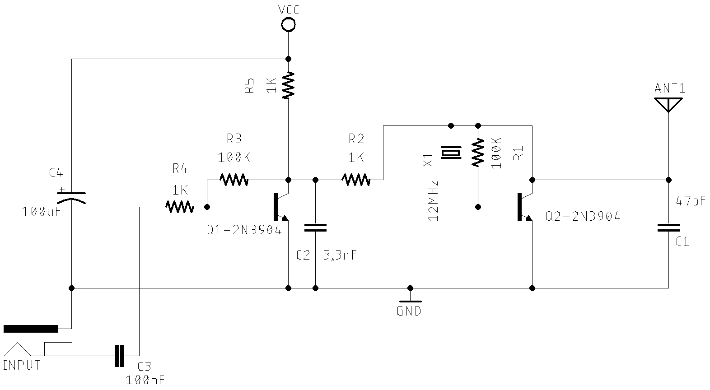
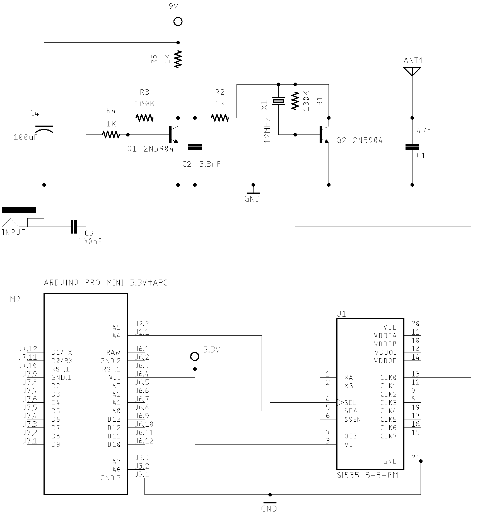
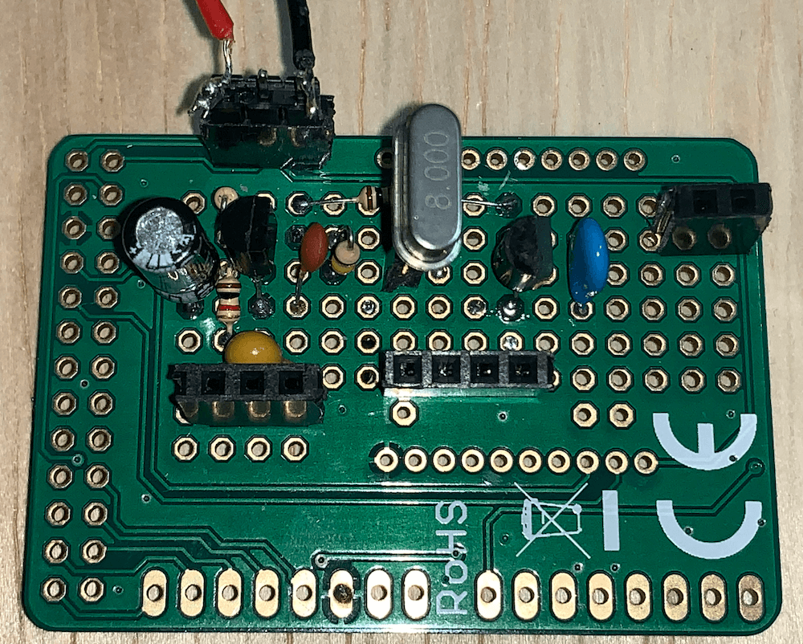
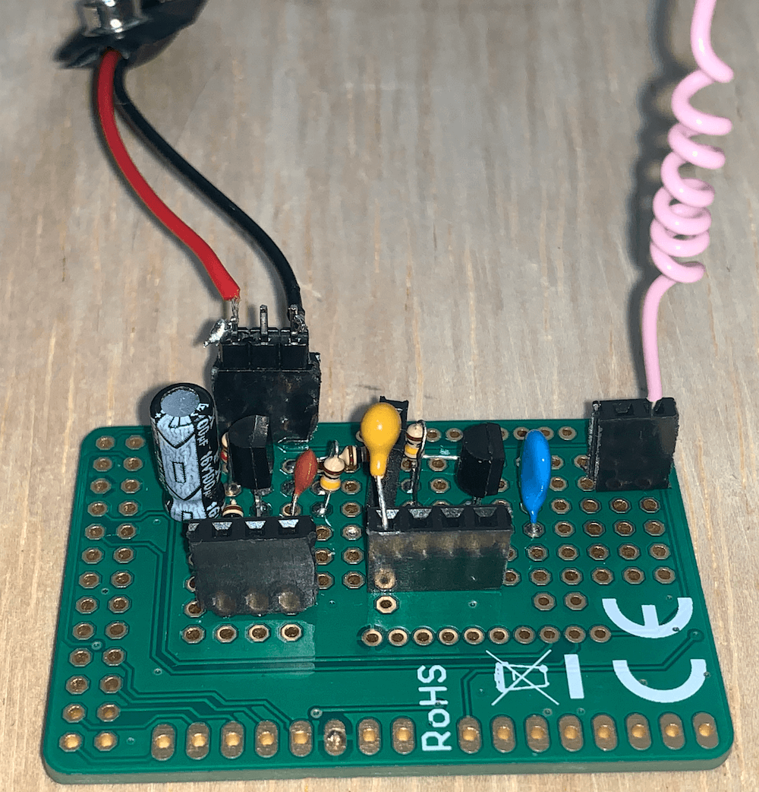
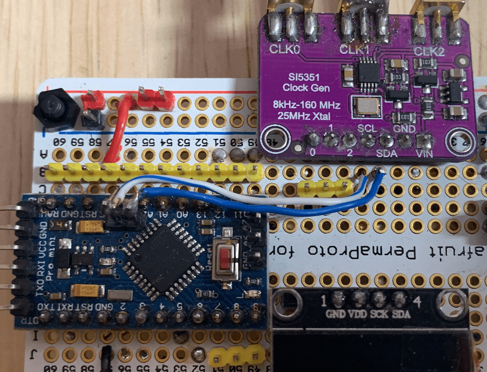
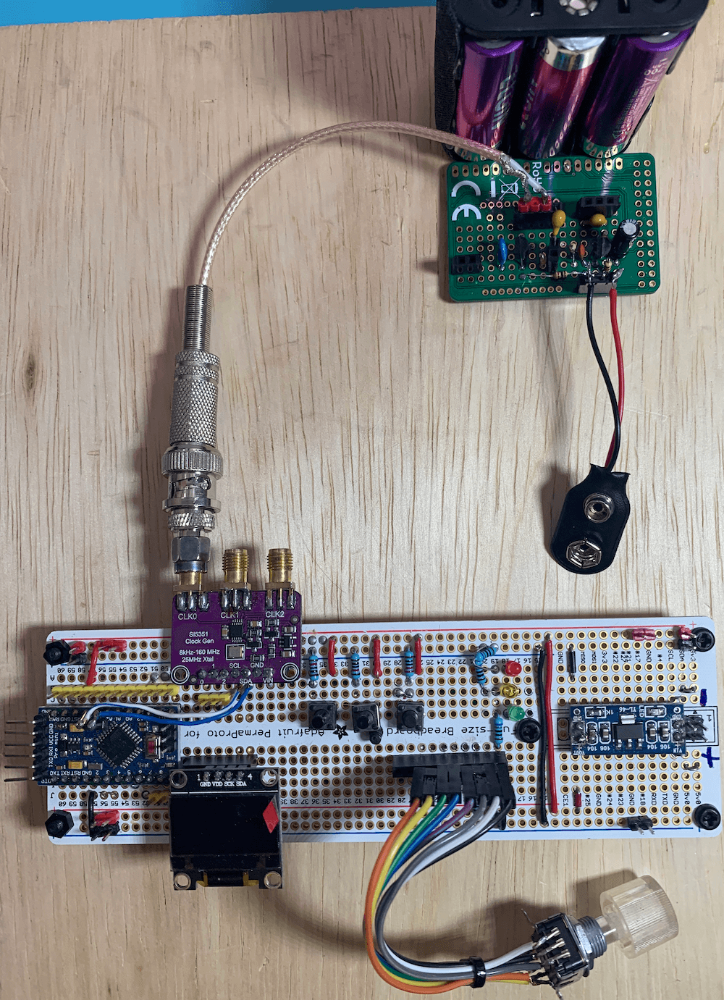
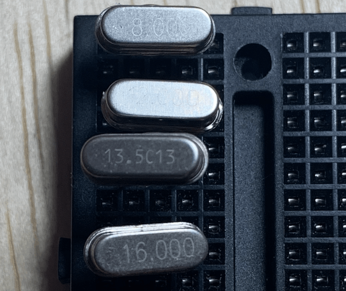

# [Shortwave Arduino Transmitter](https://pu2clr.github.io/Small-Shortwave-Transmitter/)

This project is about a shortwave transmitter from 3 MHz to 30 MHz. It uses the SI5351 oscillator from Silicon Labs controlled by Arduino. Also, you can use it with a crystal oscillator. In this case, you will not need the SI5351 device and Arduino. 

The software developed for this project can be freely distributed using the [MIT Free Software model](https://pu2clr.github.io/Small-Shortwave-Transmitter/#prefacemit-license).

[Copyright (c) 2020 Ricardo Lima Caratti](https://pu2clr.github.io/AKC695X/#mit-license). 

Be a member of Facebook group [DSP receivers for hobbyists](https://www.facebook.com/groups/2655942598067211)

## Content

1. [Preface](https://pu2clr.github.io/Small-Shortwave-Transmitter/#preface)
2. [Your support is important](https://pu2clr.github.io/Small-Shortwave-Transmitter/#your-support-is-important)
3. [Schematics](https://pu2clr.github.io/Small-Shortwave-Transmitter/#schematic)
4. [Arduino Sketch](source)
5. [References](https://pu2clr.github.io/Small-Shortwave-Transmitter/#references)

## Preface 

Recently I have been developing some Arduino libraries to control DSP receivers. The main motivation for building this shortwave transmitter is to be able to do experiments and tests during the development of the Arduino libraries for the SI473X, Si4844, AKC695X, KT0915 and others. My current location does not allow good shortwave broadcast reception most of the time. In this case, a small Shortwave (3 ~ 30 MHz) transmitter can be a good tool.  __Actually you can experiment other frequencies. If you intend to use the SI5351 oscillator version, you can modify the [Arduino sketch](https://github.com/pu2clr/Small-Shortwave-Transmitter/tree/master/source) and change that range__.

This project is originally based  on the [Stefan0719](https://youtu.be/7fe_GlJI5WI) and [SIMPLEST SHORTWAVE TRANSMITTER CIRCUIT EVER](https://www.circuitsdiy.com/simple-shortwave-transmitter-circuit/) projects that use crystal oscillator or ceramic resonator. Instead of a static oscillator, this project also allows you to use a SI5351 signal generator that can be controlled by Arduino. The main idea is to be able to transmit on any frequency in the HF band (3 ˜ 30 MHz). As mentioned earlier, you can try other frequency ranges if you want. See video below.

 

[Watching from Youtube](https://youtu.be/lIxHxvAcTSs)

### See also

The list below shows the Arduino Libraries I have developed to control DSP receivers and other Arduino projects as well.  

* [PU2CLR Si4735 Library for Arduino](https://pu2clr.github.io/SI4735/). This library was built based on “Si47XX PROGRAMMING GUIDE; AN332” and it has support to FM, AM and SSB modes (LW, MW and SW). It also can be used on all members of the SI47XX family respecting, of course, the features available for each IC version;
* [PU2CLR SI4844 Arduino Library](https://pu2clr.github.io/SI4844). This is an Arduino library for the SI4844, BROADCAST ANALOG TUNING DIGITAL * DISPLAY AM/FM/SW RADIO RECEIVER,  IC from Silicon Labs.  It is available on Arduino IDE. This library is intended to provide an easier interface for controlling the SI4844.
* [PU2CLR AKC695X Arduino Library](https://pu2clr.github.io/AKC695X/). The AKC695X is a family of IC DSP receiver from AKC technology. The AKC6955 and AKC6959sx support AM and FM modes. On AM mode the AKC6955 and AKC6959sx work on LW, MW and SW. On FM mode they work from 64MHz to 222MHz.
* [PU2CLR KT0915 Arduino Library](https://pu2clr.github.io/KT0915/). The KT0915 is a full band AM (LW, MW and SW) and FM DSP receiver that can provide you a easy way to build a high quality radio with low cost.
* [PU2CLR BK108X](https://pu2clr.github.io/BK108X/). The BK1086 and BK1088 are DSP receivers from BAKEN. The BK1088 is a BROADCAST FM and AM (LW, MW and ) RECEIVER and BK1086 is a subset of the BK1088 (it does not have LW and SW acording to the Datasheet).
* [PU2CLR RDA5807 Arduino Library](https://pu2clr.github.io/RDA5807/). The RDA5807 is a FM DSP integrated circuit receiver (50 to 115MHz) with low noise amplifier support. This device requires very few external components if compared with other similar devices. It also supports RDS/RBDS functionalities, direct auto gain control (AGC) and real time adaptive noise cancellation function.
* [PU2CLR SI470X Arduino Library](https://pu2clr.github.io/SI470X/). It is a Silicon Labs device family that integrates the complete functionalities for FM receivers, including RDS (Si4703).
* [PU2CLR MCP23008](https://pu2clr.github.io/MCP23008/). It is an Arduino Library to control the MCP23008/MCP23S08 8-Bit I/O Expander. The MCP23008 device provides 8-bit, general purpose, parallel I/O expansion. It can be controlled via I2C bus applications. It is a great and inexpensive device that allow you to add more devices to be controlled by your Arduino board via I2C protocol.
* [PU2CLR - PCF8574 Arduino Library](https://pu2clr.github.io/PCF8574/). It is an Arduino Library to control the PCF8574 8-Bit I/O Expander. The PCF8574 device provides 8-bit, general purpose, parallel I/O expansion. It can be controlled via I²C bus applications. It is a great and inexpensive device that allow you to add more peripherals to be controlled by your Arduino board via I²C protocol.

#### More Arduino Projects by author 

* [Multipurpose signal generator with SI5351](https://pu2clr.github.io/SI5351/). It is a multipurpose signal generator controlled by Arduino. This project uses the SI5351 from Silicon Labs. The Arduino sketch is configured to control the SI5351 with three channels from 32.768KHz to 160MHz and steps from 1Hz to 1MHz.
* [Android and iOS Bluetooth Remote Control for PU2CLR Arduino Library DSP receivers](https://pu2clr.github.io/bluetooth_remote_control/). This project is an extension of the Arduino library projects for: [SI4735](https://pu2clr.github.io/SI4735/); [AKC6959](https://pu2clr.github.io/AKC695X/) and [KT0915](https://pu2clr.github.io/KT0915/). It is a simple example that shows a way to use your smartphone as a remote control via Bluetooth. In order to follow the steps presented here, I am assuming that you have some knowledge in development for mobile devices. Also, you will need to be familiar with the Javascript programming language. The development environment used by this project is the [Apache Cordova](https://cordova.apache.org/docs/en/latest/guide/overview/index.html). Cordova is a open-source mobile development framework that allows you to develop cross-platform applications. That means you can code once and deploy the application in many system, including iOS and Android. 
Cordova provides an easy way to develop for iOS and Android.  
* [Band Pass Filter controlled by Arduino](https://pu2clr.github.io/auto_bpf_arduino/). It is a HF band pass filter controlled by Arduino. It is designed for HF receivers. With this project, you can use a set of up to four HF bandpass filters that can be selected by Arduino. To do that you will need just two digital Arduino pins.

## Groups

There is a __Facebook__ group called [__Si47XX for Radio Experimenters__](https://www.facebook.com/groups/532613604253401/) where the purpose is exchanging experiences with projects based on Silicon Labs  SI47XX IC family. You will be welcome to the group [Si47XX for Radio Experimenters](https://www.facebook.com/groups/532613604253401/). You can also be a member of __group.io__ [SI47XX for hobbyists](https://groups.io/g/si47xx)

## Your support is important

If you find some error or if you want suggest something else to this project, please, let me know. Thank you!

## Schematics 

A simple transmitter consists of an audio source and a carrier signal (generated by a crystal or DDS).  The audio signal is mixed with the signal generated by the oscillator and then transmitted. The audio source can be a microphone or an audio output from any device like a smartphone, computer, CD player, FM receiver etc.  The citcuits below show two very basic shortwave circuit. They provide very low power output and they can reach barely around 2 meters. 

The schematic below is based on [Stefan0719](https://youtu.be/7fe_GlJI5WI) and can be used with crystal oscillator. Use it if you want to work with a static frequency (8MHz, 12MHz, 13.56MHz etc).

If you intend to work with random frequencies between 3 and 30 MHz or other ranges, use the following circuit. 

The sketch for the circuit above can be found [here](source)

## Photos

## MIT License

Copyright (c) 2019 Ricardo Lima Caratti

Permission is hereby granted, free of charge, to any person obtaining a copy of this software and associated documentation files (the "Software"), to deal in the Software without restriction, including without limitation the rights to use, copy, modify, merge, publish, distribute, sublicense, and/or sell copies of the Software, and to permit persons to whom the Software is furnished to do so, subject to the following conditions:

The above copyright notice and this permission notice shall be included in all copies or substantial portions of the Software.

THE SOFTWARE IS PROVIDED "AS IS", WITHOUT WARRANTY OF ANY KIND, EXPRESS OR IMPLIED, INCLUDING BUT NOT LIMITED TO THE ARRANTIES OF MERCHANTABILITY, FITNESS FOR A PARTICULAR PURPOSE AND NONINFRINGEMENT. IN NO EVENT SHALL THE AUTHORS OR COPYRIGHT HOLDERS BE LIABLE FOR ANY CLAIM, DAMAGES OR OTHER LIABILITY, WHETHER IN AN ACTION OF CONTRACT, TORT OR OTHERWISE, ARISING FROM, OUT OF OR IN CONNECTION WITH THE SOFTWARE OR THE USE OR OTHER DEALINGS IN THE SOFTWARE.

## References

1. [Original Project Schematic](https://drive.google.com/file/d/1N3GuQzIK2YmYvO7QV10ZkjJ2dLMs-szc/view)
2. [Simple shortwave transmitter](https://youtu.be/7fe_GlJI5WI)
3. [SIMPLEST SHORTWAVE TRANSMITTER CIRCUIT EVER](https://www.circuitsdiy.com/simple-shortwave-transmitter-circuit/)
4. [DIY Simple Short Wave Transmitter With XTAL Oscillator Steady Frequency](https://youtu.be/4UGzL5FCcMM)
5. [13.56Mhz shortwave transmitter](https://youtu.be/VYizasHR564)
6. [A DDS VFO for Codan Transceivers](https://www.qsl.net/zl1bpu/PROJ/ddsvfo.htm)
7. [Replacing Crystal Oscillator with DDS](https://electronics.stackexchange.com/questions/139421/replacing-crystal-oscillator-with-dds)
8. [A Technical Tutorialon Digital Signal Synthesis](https://www.analog.com/media/cn/training-seminars/tutorials/450968421DDS_Tutorial_rev12-2-99.pdf)
   
